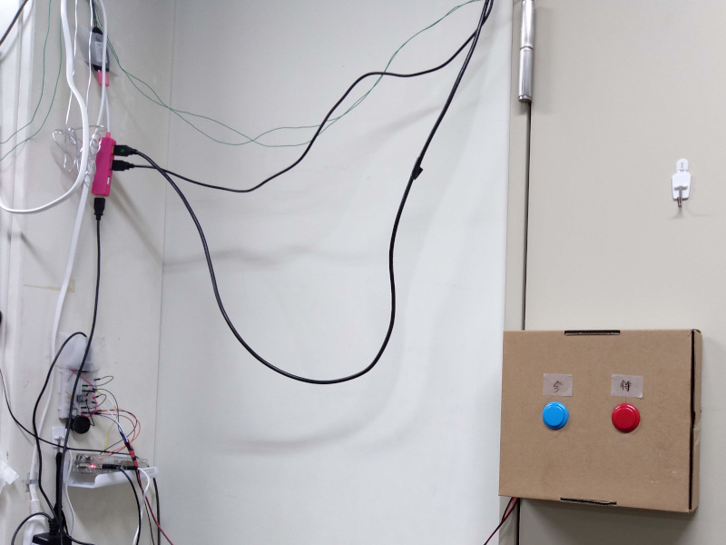

# 開発

<section class="s-projects">
  

    <a href="https://github.com/aoirint/RoomSystem" target="_blank" class="project">
      
      

        <h3 class="project-title">RoomSystem</h3>
        
2018-

        
個人開発

        <ul class="project-tags">
          <li>環境センサ</li>
          <li>スピーカ</li>
          <li>Arduino</li>
          <li>Raspberry Pi</li>
          <li>Firebase</li>
          <li>React.ts</li>
          <li>Python</li>
        </ul>
        

          サークル室の環境情報をオンライン化
        

      

    </a>

    <a href="https://github.com/aoirint/Dockernize" target="_blank" class="project">
      
      

        <h3 class="project-title">Docker化関連</h3>
        
2020-

        
個人開発

        <ul class="project-tags">
          <li>Docker</li>
        </ul>
        

          各種Dockerfileの作成
        

      

    </a>

    <a href="https://github.com/aoirint/BiImageTransform" target="_blank" class="project">
      
      

        <h3 class="project-title">PyTorch 4ch画像Transformライブラリ</h3>
        
2020

        
個人開発

        <ul class="project-tags">
          <li>PyTorch</li>
          <li>深層学習</li>
        </ul>
        

          カラー・マスクの4ch画像用Transformライブラリ
        

      

    </a>

    <a href="https://github.com/aoirint/Mnemosyne" target="_blank" class="project">
      
      

        <h3 class="project-title">Mnemosyne</h3>
        
2019

        
個人開発

        <ul class="project-tags">
          <li>3Dプリンタ</li>
          <li>Django</li>
          <li>Python</li>
        </ul>
        

          3Dプリンタのフィラメント使用量を管理するWebアプリ
        

      

    </a>

    <a href="https://github.com/aoirint/SSBUFrameAnalyzer" target="_blank" class="project">
      
      

        <h3 class="project-title">スマブラSP 対戦画面解析</h3>
        
2019

        
個人開発

        <ul class="project-tags">
          <li>OpenCV</li>
          <li>OCR</li>
          <li>画像特徴量</li>
          <li>Python</li>
        </ul>
        

          スマブラSPの対戦画面から情報抽出
        

      

    </a>

    <a href="https://github.com/kanomiya" target="_blank" class="project">
      
      

        <h3 class="project-title">Minecraft Modding</h3>
        
2014-2018

        
個人開発

        <ul class="project-tags">
          <li>Java</li>
          <li>Minecraft Forge</li>
        </ul>
        
1.7.10-1.10.2

      

    </a>

  

</section>
