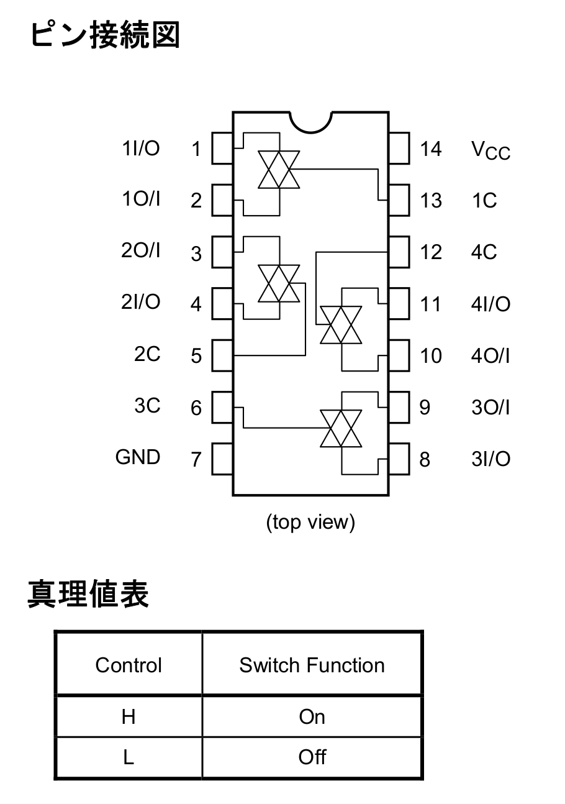

# ArduinoのPWM信号をアナログスイッチで非同時4ch音源として使う

[4回路入り CMOSアナログスイッチ TC74HC4066AP(F)｜電子部品・半導体通販のマルツ](https://www.marutsu.co.jp/pc/i/37603/)

アナログスイッチというものを買って試してみました。
その名の通りアナログ信号をスイッチングするICです。
マイコンにArduinoを使いました。

ラインデコーダなんかを使って2bitにしてもいいのですが、
とりあえずArduinoの4、5、6、7番ピンをアナログスイッチのスイッチングに使います。
データシートから、それぞれIC側の13、5、6、12番ピン（1C、2C、3C、4C）に接続します。

データシートより引用

各ピンがHighのときに
